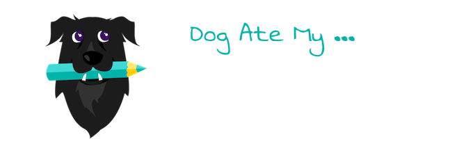

# dam-metronome

dam-metronome is a custom element that was made with StencilJS and web audio api.  

## Installation

You can use the dam-metronome by either 

```html
npm i dam-metronome
```   

or by including it in your html with script tag

```html
 <script nomodule src="https://unpkg.com/dam-metronome/dist/dam-metronome/dam-metronome.js"></script>
 <script type="module" src="https://unpkg.com/dam-metronome/dist/dam-metronome/dam-metronome.esm.js"></script>
```

## Usage

```html
<dam-metronome></dam-metronome>
```
or
```html
<dam-metronome src="./assets/click.wav"></dam-metronome>
```

## Contributing

1. Fork it!
2. Create your feature branch: `git checkout -b my-new-feature`
3. Commit your changes: `git commit -am 'Add some feature'`
4. Push to the branch: `git push origin my-new-feature`
5. Submit a pull request :D

## License

[MIT License](./LICENSE)
